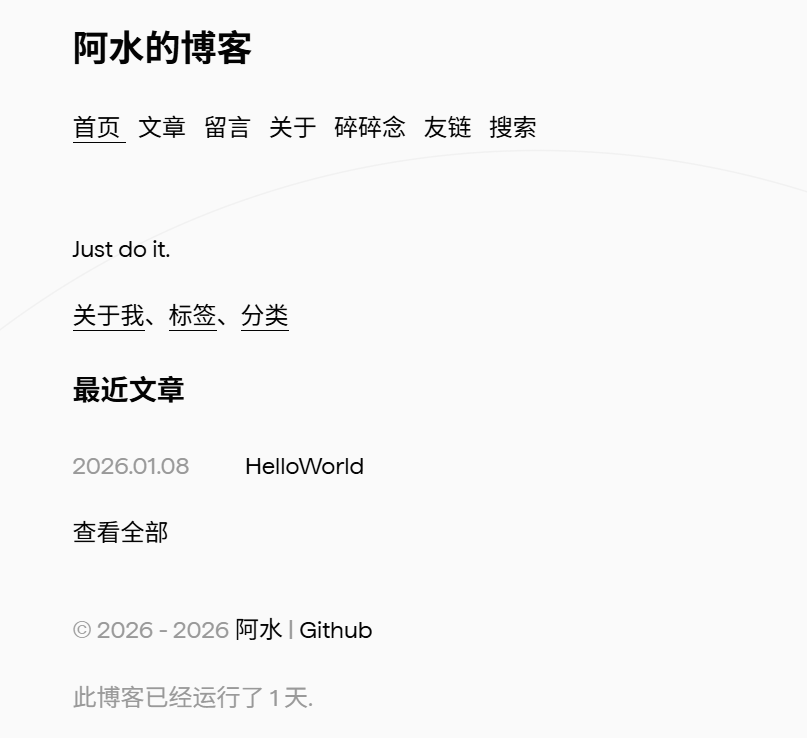

## Astro Blog

> 🚀 基于 Astro 构建的现代化个人博客系统，采用服务器端渲染，性能卓越，SEO 友好。

[阿水的博客](https://blog.fanxiao.online/)



## Command

启用草稿，在 frontmatter 设置：

```md
---
draft: true
---
```

| Command             | Action                                   |
| :------------------ | :--------------------------------------- |
| `npm install`     | 安装依赖项                               |
| `npm run dev`     | 在 `localhost:4321` 启动本地开发服务器 |
| `npm run build`   | 构建您的生产站点到 `./dist/`           |
| `npm run preview` | 预览本地构建，再部署                     |

## 致谢

- [Astro](https://astro.build/) - 现代化的 Web 框架
- [Bear Blog](https://github.com/HermanMartinus/bearblog/) - 设计灵感
- [Twikoo](https://twikoo.js.org/) - 评论系统

本仓库/博客基于子舒的博客修改。
