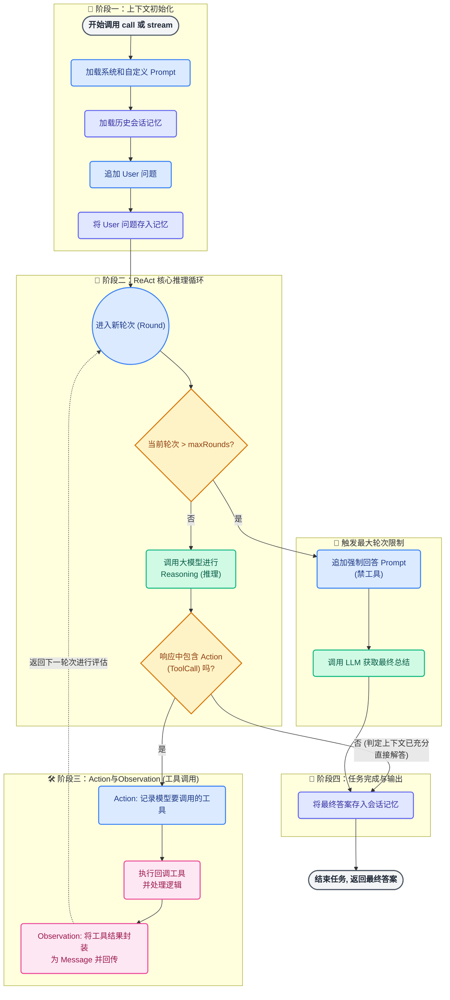
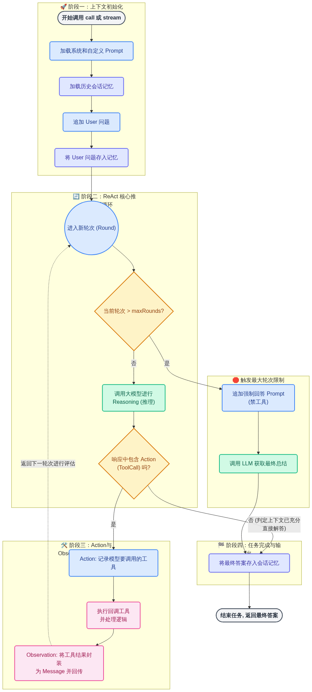
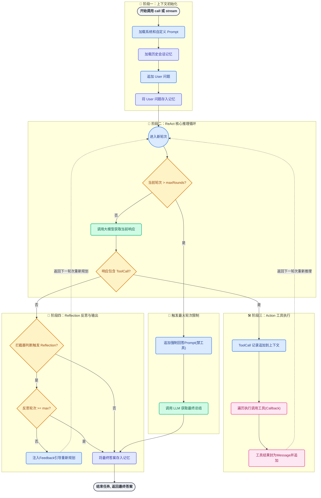
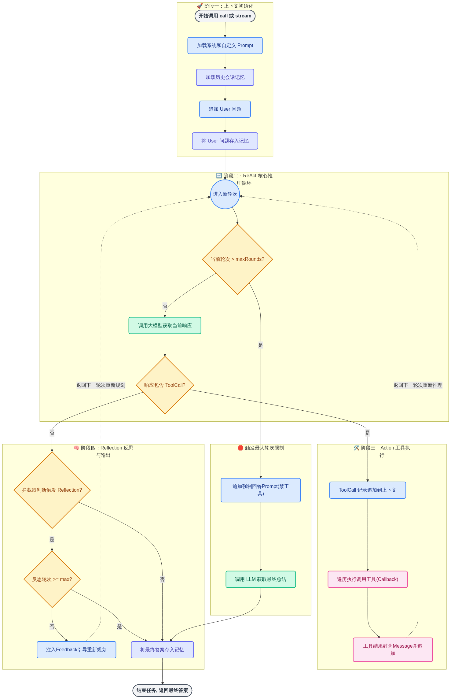
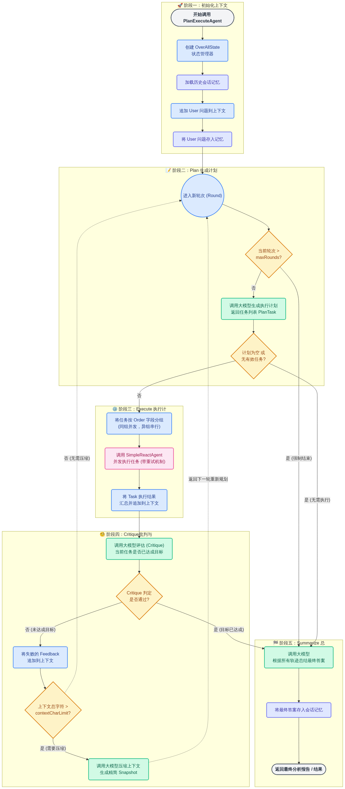
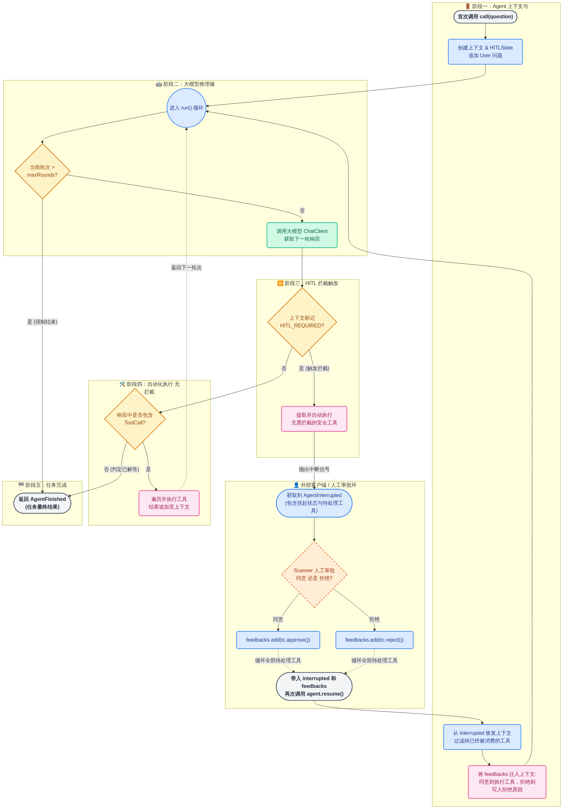

## Agent常用架构

随着ai学习的深入，慢慢接触到了常用架构，这篇文章用流程图的方式，简单介绍一下agent的四种常用架构。

## 目录
- [RactAgent](#ractagent)
- [ReflectionAgent](#reflectionagent)
- [PlanExecuteAgent](#planexecuteagent)
- [HITLReactAgent](#hitlreactagent)


### RactAgent
>针对用户的提问，LLM会先进行思考（Thought），指定行动计划，行动计划中包括使用哪些工具，接着进行工具执行（Action），在工具执行之后，观察（Observation）工具执行的结果，基于结果继续思考后续的行动计划。如果需要执行工具就继续执行，直到LLM认为所有行动都做完了为止。




### ReflectionAgent
>它是一种让模型自我批判、自我修正的策略。其核心思想是：让大语言模型（LLM）在完成任务后，对其自身的行为或输出进行批判性反思，并基于反思结果进行改进。




### PlanExecuteAgent
>围绕全局状态反复的迭代执行。它的核心目标不是尽快给出答案，而是在复杂、多步骤任务中，保证每一步的决策、执行和结果都可控、可追踪、可修正。整个流程可以抽象拆分为：规划、执行、批判、压缩、迭代与总结这6个阶段。
```marmaid
graph TD
    classDef startEnd fill:#F3F4F6,stroke:#4B5563,stroke-width:2px,rx:10,ry:10,color:#1F2937,font-weight:bold;
    classDef process fill:#DBEAFE,stroke:#3B82F6,stroke-width:2px,rx:5,ry:5,color:#1E3A8A;
    classDef decision fill:#FEF3C7,stroke:#D97706,stroke-width:2px,rx:5,ry:5,color:#92400E;
    classDef llm fill:#D1FAE5,stroke:#10B981,stroke-width:2px,rx:5,ry:5,color:#065F46;
    classDef tool fill:#FCE7F3,stroke:#EC4899,stroke-width:2px,rx:5,ry:5,color:#9D174D;
    classDef memory fill:#E0E7FF,stroke:#6366F1,stroke-width:2px,rx:5,ry:5,color:#3730A3;

    Start(["开始调用 PlanExecuteAgent"]):::startEnd
    EndLoop(["返回最终分析报告 / 结果"]):::startEnd

    subgraph Phase1 [🚀 阶段一：初始化上下文]
        CreateState["创建 OverAllState<br/>状态管理器"]:::process
        LoadMem["加载历史会话记忆"]:::memory
        AddUser["追加 User 问题到上下文"]:::process
        SaveUserMem["将 User 问题存入记忆"]:::memory

        Start --> CreateState
        CreateState --> LoadMem
        LoadMem --> AddUser
        AddUser --> SaveUserMem
    end

    subgraph Phase2 [📝 阶段二：Plan 生成计划]
        LoopStart(("进入新轮次 (Round)")):::process
        CheckRounds{"当前轮次 ><br/>maxRounds?"}:::decision
        GenPlan["调用大模型生成执行计划<br/>返回任务列表 PlanTask"]:::llm
        CheckPlan{"计划为空 或<br/>无有效任务?"}:::decision

        SaveUserMem --> LoopStart
        LoopStart --> CheckRounds
        CheckRounds -- "否" --> GenPlan
        GenPlan --> CheckPlan
    end

    subgraph Phase3 [⚙️ 阶段三：Execute 执行计划]
        GroupTasks["将任务按 Order 字段分组<br/>(同组并发，异组串行)"]:::process
        ExecAsync["调用 SimpleReactAgent<br/>并发执行任务 (带重试机制)"]:::tool
        SaveResults["将 Task 执行结果<br/>汇总并追加到上下文"]:::process

        CheckPlan -- "否" --> GroupTasks
        GroupTasks --> ExecAsync
        ExecAsync --> SaveResults
    end

    subgraph Phase4 [🧐 阶段四：Critique批判与压缩]
        CritiqueLLM["调用大模型评估 (Critique)<br/>当前任务是否已达成目标"]:::llm
        CheckPassed{"Critique 判定<br/>是否通过?"}:::decision
        AddFeedback["将失败的 Feedback<br/>追加到上下文"]:::process
        CheckSize{"上下文总字符 ><br/>contextCharLimit?"}:::decision
        Compress["调用大模型压缩上下文<br/>生成精简 Snapshot"]:::llm

        SaveResults --> CritiqueLLM
        CritiqueLLM --> CheckPassed
        
        CheckPassed -- "否 (未达成目标)" --> AddFeedback
        AddFeedback --> CheckSize
        
        CheckSize -- "是 (需要压缩)" --> Compress
        Compress -. "返回下一轮重新规划" .-> LoopStart
        CheckSize -. "否 (无需压缩)" .-> LoopStart
    end

    subgraph Phase5 [🏁 阶段五：Summarize 总结输出]
        FinalSummary["调用大模型<br/>根据所有轨迹总结最终答案"]:::llm
        SaveFinalMem["将最终答案存入会话记忆"]:::memory

        CheckRounds -- "是 (强制结束)" --> FinalSummary
        CheckPlan -- "是 (无需执行)" --> FinalSummary
        CheckPassed -- "是 (目标已达成)" --> FinalSummary

        FinalSummary --> SaveFinalMem
        SaveFinalMem --> EndLoop
    end
```



### HITLReactAgent
>Human-in-the-Loop（简称 HITL） 指的是在 AI 系统中的自动决策或执行过程中，引入人类用户作为“必要参与者”，在关键节点对 AI 的行为和结果进行审查、确认或修正，而不是让模型完全自动完成端到端的执行。在 Agent 场景下，HITL 的核心并不是用户参与推理，而是：在用户允许的边界内，让 Agent 自动运行；一旦即将执行高风险或高不确定性的动作，必须经过人工确认。HITL 本质上是一种 流程控制机制。
```mardaid
graph TD
    classDef startEnd fill:#F3F4F6,stroke:#4B5563,stroke-width:2px,rx:10,ry:10,color:#1F2937,font-weight:bold;
    classDef process fill:#DBEAFE,stroke:#3B82F6,stroke-width:2px,rx:5,ry:5,color:#1E3A8A;
    classDef decision fill:#FEF3C7,stroke:#D97706,stroke-width:2px,rx:5,ry:5,color:#92400E;
    classDef llm fill:#D1FAE5,stroke:#10B981,stroke-width:2px,rx:5,ry:5,color:#065F46;
    classDef tool fill:#FCE7F3,stroke:#EC4899,stroke-width:2px,rx:5,ry:5,color:#9D174D;
    classDef human fill:#FFEDD5,stroke:#EA580C,stroke-width:2px,rx:5,ry:5,color:#9A3412,stroke-dasharray: 5 5;

    StartCall(["首次调用 call(question)"]):::startEnd
    EndFinish(["返回 AgentFinished<br/>(任务最终结果)"]):::startEnd

    subgraph ClientSide [👤 外部客户端 / 人工审批环节]
        InterruptState(["获取到 AgentInterrupted<br/>(包含挂起状态与待处理工具)"]):::process
        HumanInput{"Scanner 人工审批<br/>同意 还是 拒绝?"}:::human
        ApproveAdd["feedbacks.add(tc.approve())"]:::process
        RejectAdd["feedbacks.add(tc.reject())"]:::process
        CallResume(["带入 interrupted 和 feedbacks<br/>再次调用 agent.resume()"]):::startEnd

        InterruptState --> HumanInput
        HumanInput -- "同意" --> ApproveAdd
        HumanInput -- "拒绝" --> RejectAdd
        ApproveAdd -. 循环全部待处理工具 .-> CallResume
        RejectAdd -. 循环全部待处理工具 .-> CallResume
    end

    subgraph Phase1 [🚪 阶段一：Agent 上下文与状态恢复]
        InitState["创建上下文 & HITLState<br/>追加 User 问题"]:::process
        RestoreState["从 interrupted 恢复上下文<br/>过滤掉已经被消费的工具"]:::process
        ProcessFeedbacks["将 feedbacks 注入上下文:<br/>同意则执行工具，拒绝则<br/>写入拒绝原因"]:::tool

        StartCall --> InitState
        CallResume --> RestoreState
        RestoreState --> ProcessFeedbacks
    end

    subgraph Phase2 [🤖 阶段二：大模型推理循环]
        LoopStart(("进入 run() 循环")):::process
        CheckRounds{"当前轮次 ><br/>maxRounds?"}:::decision
        CallLLM["调用大模型 ChatClient<br/>获取下一轮响应"]:::llm

        InitState --> LoopStart
        ProcessFeedbacks --> LoopStart
        LoopStart --> CheckRounds
        CheckRounds -- "否" --> CallLLM
    end

    subgraph Phase3 [⏸️ 阶段三：HITL 拦截触发]
        CheckHITL{"上下文标记<br/>HITL_REQUIRED?"}:::decision
        ExecNonIntercept["提取并自动执行<br/>无需拦截的安全工具"]:::tool

        CallLLM --> CheckHITL
        CheckHITL -- "是 (触发拦截)" --> ExecNonIntercept
        
        %% 连接回客户端的挂起状态
        ExecNonIntercept -->|抛出中断信号| InterruptState
    end

    subgraph Phase4 [🛠️ 阶段四：自动化执行 无拦截]
        CheckTools{"响应中是否包含<br/>ToolCall?"}:::decision
        ExecAllTools["遍历并执行工具<br/>结果追加至上下文"]:::tool

        CheckHITL -- "否" --> CheckTools
        CheckTools -- "是" --> ExecAllTools
        ExecAllTools -. "返回下一轮次" .-> LoopStart
    end

    subgraph Phase5 [🏁 阶段五：任务完成]
        CheckRounds -- "是 (强制结束)" --> EndFinish
        CheckTools -- "否 (判定已解答)" --> EndFinish
    end
```


