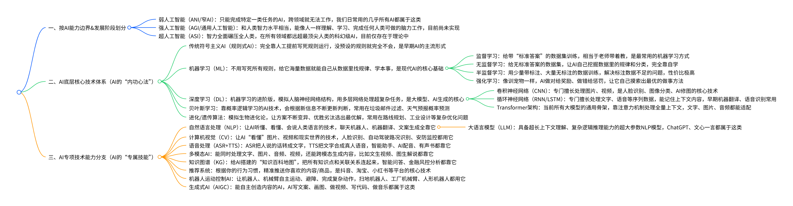

## AI初识
* 距离搭建博客已经快两个月了，也不全是主观因素，搭建完没多久就请假准备过年了，年后回来收拾了一屁股事，然后就一直拖到了现在。
### 豆包生成的AI思维导图

### Gemini生成的AI思维导图


* 下面是这段时间接触AI的一些总结，公司要用做给员工的培训，所以也想分享一下。

# AI工具列举
## 2api
> 收费中转服务商
>

[https://api.oaipro.com/](https://api.oaipro.com/)

---

## AI模型(api)
### OpenAI家的ChatGPT(platform.openai.com)
卡ip，用好梯子就能进，plus找渠道买号，试用

### Anthropic家的Claude
### Google家的Gemini(aistudio.google.com)
### DeepSeek家的DeepSeek
### 阿里巴巴家的Qwen
### 月之暗面家的Kimi
### 智谱家的GLM
### 字节跳动的豆包
---

## AI工具
> **官方**
>

> 软件
>

### [Windsurf](https://windsurf.com/)
### [Cursor](https://cursor.com/cn)
找渠道买号，试用

### [Antigravity](https://antigravity.google/)
和Gemini绑定的，用pro账号可以5h一刷新额度，用opus牛得很

### [国产Trae](https://www.trae.ai/)
> 命令行
>

### [Claude Code](https://github.com/anthropics/claude-code)
官方要钱，可以接api(代理商，2api)，cmd运行

### [Codex](https://github.com/openai/codex)
卡ip，用好梯子就能进，plus找渠道买号，试用

### [Gemini](https://github.com/google-gemini/gemini-cli)
学生账户，一年pro，找渠道买号

---

## 插件
> 官方
>

### GitHub Copilot
### Augment Code
### Codex
---

## AI agents
### [OpenClawd](https://docs.openclaw.ai/zh-CN/start/getting-started)
---

# 着重介绍三款常用的cli
## 什么是 Claude Code & CodeX & Gemini CLI？
现代开发者的 AI 编程助手，三款强大工具让代码开发变得简单高效
 
### 实际开发体验对比

### 核心功能特性
> 强大的AI编程工具集，全方位提升开发效率
>

### 系统要求
#### Windows
+ Windows 10 或 Windows 11
+ Node.js 18+
+ 网络连接

#### macOS
+ macOS 10.15 (Catalina) 或更高版本
+ Node.js 18+
+ 网络连接

#### Linux
+ Ubuntu 18.04+, CentOS 7+, Debian 9+
+ Node.js 18+
+ 网络连接


## Claude Code 安装步骤
详细的分平台安装指南

### 🚀 Claude Code 快速开始
Anthropic 官方 CLI 工具，Claude Sonnet 4.5 驱动

1安装 CLI

2配置密钥

3开始编程

### 🪟 Windows 版本教程
#### 系统要求
+ • Windows 10 或 Windows 11
+ • Node.js 18+
+ • 网络连接

#### 1 安装 Node.js
**方法一：使用官方安装包（推荐）**

1. 访问 [https://nodejs.org](https://nodejs.org/)
2. 下载 LTS 版本的 Windows Installer (.msi)
3. 运行安装程序，按默认设置完成安装
4. 安装程序会自动添加到 PATH 环境变量

**方法二：使用包管理器**

使用 **Winget**（Windows 11 或 Windows 10 自带）：

PowerShell（管理员）

```plain
winget install OpenJS.NodeJS.LTS
```

使用 **Chocolatey**：

PowerShell（管理员）

```plain
choco install nodejs-lts
```

使用 **Scoop**：

PowerShell

```plain
scoop install nodejs-lts
```

**验证安装：**

CMD/PowerShell

```plain
node --version
npm --version
```

**提示：** 建议使用 LTS（长期支持）版本以获得最佳稳定性。安装完成后需重启命令行窗口。

#### 2 安装 Claude Code CLI
打开命令提示符（以管理员身份运行）或 PowerShell，执行以下命令：

CMD/PowerShell

```plain
npm install -g @anthropic-ai/claude-code
```

**验证安装：**

CMD/PowerShell

```plain
claude --version
```

**注意：**如果遇到权限问题，请确保以管理员身份运行命令提示符。

#### 3 配置 API
##### 3.1 获取 Auth Token
访问  控制台 进行以下操作：

+ • 点击「添加令牌」
+ • 令牌名称：随意填写
+ • 其他选项保持默认

##### 3.2 配置环境变量
重要提示：请将下方的 ANTHROPIC_AUTH_TOKEN 替换为您在 控制台 生成的Claude Code专用 API 密钥！

###### settings.json 配置（推荐，永久生效）
配置位置：`%USERPROFILE%\.claude\settings.json`

```plain
{
  "env": {
    "ANTHROPIC_AUTH_TOKEN": "粘贴为Claude Code专用分组令牌key",
    "ANTHROPIC_BASE_URL": "https://xxx"
  }
}
```

**注意：** 配置文件更加安全且便于管理，需要重启 Claude Code 才生效。

#### 4 启动 Claude Code
配置完成后，先进入到工程目录：

CMD/PowerShell

```plain
cd your-project-folder
```

然后，运行以下命令启动：

CMD/PowerShell

```plain
claude
```

**首次启动后需要先进行主题的选择等操作：**

+ • 选择喜欢的主题（回车）
+ • 确认安全须知（回车）
+ • 使用默认  配置（回车）
+ • 信任工作目录（回车）
+ • 开始编程！🚀

### 🍎 Mac 版本教程
#### 系统要求
+ • macOS 10.15 (Catalina) 或更高版本
+ • Node.js 18+
+ • 网络连接

#### 1 安装 Node.js
**方法一：使用 Homebrew（推荐）**

如果尚未安装 Homebrew：

```plain
/bin/bash -c "$(curl -fsSL https://raw.githubusercontent.com/Homebrew/install/HEAD/install.sh)"
```

使用 Homebrew 安装 Node.js：

```plain
brew install node
```

**方法二：使用官方安装包**

1. 访问 [https://nodejs.org](https://nodejs.org/)
2. 下载 LTS 版本的 macOS Installer (.pkg)
3. 运行安装程序，按默认设置完成安装
4. 安装程序会自动添加到 PATH 环境变量

**验证安装：**

```plain
node --version
npm --version
```

#### 2 安装 Claude Code CLI
打开终端，执行以下命令：

```plain
npm install -g @anthropic-ai/claude-code
```

**验证安装：**

```plain
claude --version
```

#### 3 配置 API
##### 3.1 获取 Auth Token
访问 控制台 进行以下操作：

+ • 点击「添加令牌」
+ • 令牌名称：随意填写
+ • 其他选项保持默认

##### 3.2 配置环境变量
将下方的 ANTHROPIC_AUTH_TOKEN 替换为在控制台生成的Claude Code专用 API 密钥

###### settings.json 配置（推荐，永久生效）
配置位置：`~/.claude/settings.json` 或 `.claude/settings.json`

settings.json  
配置

```plain
{
  "env": {
    "ANTHROPIC_AUTH_TOKEN": "粘贴为Claude Code分组令牌key",
    "ANTHROPIC_BASE_URL": "https://xxx"
  }
}
```

**注意：** 配置文件更加安全且便于管理，需要重启 Claude Code 才生效。

#### 4 启动 Claude Code
配置完成后，先进入到工程目录：

```plain
cd your-project-folder
```

运行以下命令启动：

```plain
claude
```

**首次启动后需要先进行主题的选择等操作：**

+ • 选择喜欢的主题（回车）
+ • 确认安全须知（回车）
+ • 使用默认  配置（回车）
+ • 信任工作目录（回车）
+ • 开始编程！🚀

### 🐧 Linux 版本教程
#### 系统要求
+ • Linux 发行版 (Ubuntu 18.04+, CentOS 7+, Debian 9+)
+ • Node.js 18+
+ • 网络连接

#### 1 安装 Node.js
**方法一：使用官方安装包（推荐）**

1. 访问 [https://nodejs.org](https://nodejs.org/)
2. 下载 LTS 版本的 Linux Binaries
3. 解压并安装到系统目录
4. 配置 PATH 环境变量

**方法二：使用包管理器**

##### Ubuntu/Debian
更新包列表：

```plain
sudo apt update
```

安装 Node.js：

```plain
curl -fsSL https://deb.nodesource.com/setup_lts.x | sudo -E bash -
sudo apt-get install -y nodejs
```

##### CentOS/RHEL/Fedora
使用 dnf (Fedora) 或 yum (CentOS/RHEL)：

```plain
sudo dnf install nodejs npm
# 或者
sudo yum install nodejs npm
```

##### Arch Linux
```plain
sudo pacman -S nodejs npm
```

**验证安装：**

```plain
node --version
npm --version
```

#### 2 安装 Claude Code CLI
打开终端，执行以下命令：

```plain
npm install -g @anthropic-ai/claude-code
```

**验证安装：**

```plain
claude --version
```

#### 3 配置 API
##### 3.1 获取 Auth Token
访问控制台 进行以下操作：

+ • 点击「添加令牌」
+ • 令牌名称：随意填写
+ • 其他选项保持默认

##### 3.2 配置环境变量
重要提示：请将下方的 ANTHROPIC_AUTH_TOKEN 替换为您在 控制台 生成的Claude Code API 密钥！

###### settings.json 配置（推荐，永久生效）
配置位置：`~/.claude/settings.json`

settings.json  
配置

```plain
{
  "env": {
    "ANTHROPIC_AUTH_TOKEN": "粘贴为Claude Code专用分组令牌key",
    "ANTHROPIC_BASE_URL": "https://xxx"
  }
}
```

**注意：** 配置文件更加安全且便于管理，需要重启 Claude Code 才生效。

#### 4 启动 Claude Code
配置完成后，先进入到工程目录：

```plain
cd your-project-folder
```

运行以下命令启动：

```plain
claude
```

**首次启动后需要先进行主题的选择等操作：**

+ • 选择喜欢的主题（回车）
+ • 确认安全须知（回车）
+ • 使用默认  配置（回车）
+ • 信任工作目录（回车）
+ • 开始编程！🚀

## CodeX 安装步骤
强大的 OpenAI 代码助手安装指南

### 🚀 CodeX 快速开始
企业级 AI 编程助手，GPT-5 驱动

1环境准备

2安装配置

3开始编程

### 🪟 Windows 完整安装教程
#### 1 安装 Node.js
**方法一：使用官方安装包（推荐）**

1. 访问 [https://nodejs.org](https://nodejs.org/)
2. 下载 LTS 版本的 Windows Installer (.msi)
3. 运行安装程序，按默认设置完成安装
4. 安装程序会自动添加到 PATH 环境变量

**方法二：使用包管理器**

使用 **Winget**（Windows 11 或 Windows 10 自带）：

PowerShell（管理员）

```plain
winget install OpenJS.NodeJS.LTS
```

使用 **Chocolatey**：

PowerShell（管理员）

```plain
choco install nodejs-lts
```

使用 **Scoop**：

PowerShell

```plain
scoop install nodejs-lts
```

**验证安装：**

CMD/PowerShell

```plain
node --version
npm --version
```

**提示：** 建议使用 LTS（长期支持）版本以获得最佳稳定性。安装完成后需重启命令行窗口。

#### 2 安装 CodeX CLI
打开命令提示符（以管理员身份运行）或 PowerShell，执行以下命令：

CMD/PowerShell

```plain
npm install -g @openai/codex@latest
```

**验证安装：**

CMD/PowerShell

```plain
codex --version
```

**注意：**如果遇到权限问题，请确保以管理员身份运行命令提示符。

#### 3 配置 API
##### 3.1 获取 CodeX 专用 API Token
+ • 访问控制台
+ • 注册账户或登录现有账户
+ • 进入 "API 密钥" 页面
+ • 生成的 API Key

##### 3.2 创建配置文件夹
CMD/PowerShell

```plain
mkdir %USERPROFILE%\.codex
cd %USERPROFILE%\.codex
```

##### 3.3 创建配置文件
**1. 创建 config.toml 文件：**

使用记事本或您喜欢的文本编辑器创建 config.toml 文件：

```plain
model_provider = "Van"
model = "gpt-5.3-codex"
model_reasoning_effort = "xhigh"
network_access = "enabled"
disable_response_storage = true

[model_providers.Van]
name = "OpenAI"
base_url = "https://xxx/v1"
wire_api = "responses"
requires_openai_auth = true
```

**2. 创建 auth.json 文件：**

在同一目录下创建 auth.json 文件：

```plain
{
  "OPENAI_API_KEY": "粘贴为CodeX专用分组令牌key"
}
```

#### 4 启动 CodeX
配置完成后，先进入到工程目录：

CMD/PowerShell

```plain
mkdir my-codex-project
cd my-codex-project
```

然后，运行以下命令启动：

CMD/PowerShell

```plain
codex
```

**首次运行配置：**

+ • 选择您的开发环境配置
+ • 配置代码生成偏好
+ • 设置 GPT-5 推理等级
+ • 开始 AI 辅助编程！🚀

### 🍎 macOS 完整安装教程
#### 1 安装 Node.js
**方法一：使用 Homebrew（推荐）**

```plain
# 安装 Homebrew（如果未安装）
/bin/bash -c "$(curl -fsSL https://raw.githubusercontent.com/Homebrew/install/HEAD/install.sh)"

# 安装 Node.js
brew install node

# 验证安装
node --version
npm --version
```

**方法二：官网下载**

+ 访问 [https://nodejs.org](https://nodejs.org/)
+ 下载 LTS 版本的 .pkg 安装包
+ 双击安装包，按提示完成安装

#### 2 安装 CodeX CLI
打开终端，执行以下命令：

```plain
# 全局安装 CodeX
npm install -g @openai/codex@latest

# 验证安装
codex --version
```

**提示：**如果遇到权限问题，可能需要使用 `sudo` 或配置 npm 全局目录。

#### 3 配置 API
**获取 CodeX 专用 API Token：**

1. 访问 控制台
2. 点击「添加令牌」
3. 令牌名称：随意填写
4. 其他选项保持默认

**创建配置文件：**

```plain
# 创建 CodeX 配置目录
mkdir -p ~/.codex
cd ~/.codex
```

创建 config.toml 文件

```plain
# 创建配置文件
cat > config.toml << 'EOF'
model_provider = "Van"
model = "gpt-5.3-codex"
model_reasoning_effort = "xhigh"
network_access = "enabled"
disable_response_storage = true

[model_providers.Van]
name = "OpenAI"
base_url = "https://xxx/v1"
wire_api = "responses"
requires_openai_auth = true
EOF
```

创建 auth.json 文件

```plain
# 创建认证文件
cat > auth.json << 'EOF'
{
  "OPENAI_API_KEY": "粘贴为CodeX专用分组令牌key"
}
EOF
```

#### 4 初始化项目并开始使用
```plain
# 创建新项目
mkdir my-codex-project
cd my-codex-project

# 启动 CodeX
codex
```

**首次运行配置：**

+ • 选择您的开发环境配置
+ • 配置代码生成偏好
+ • 设置 GPT-5 推理等级
+ • 开始 AI 辅助编程！🚀

### 🐧 Linux 完整安装教程
#### 1 安装 Node.js
##### 方法一：使用官方安装器（推荐）
1. 访问 [https://nodejs.org](https://nodejs.org/)
2. 下载 LTS 版本的 Linux 安装包
3. 按照官方安装说明完成安装
4. 打开终端验证安装成功

##### 验证安装
```plain
node --version
npm --version
```

##### 方法二：使用包管理器
**Ubuntu/Debian 系统：**

```plain
# 更新软件包列表
sudo apt update

# 安装 Node.js 和 npm
sudo apt install -y nodejs npm

# 验证安装
node --version
npm --version
```

**CentOS/RHEL/Fedora 系统：**

```plain
# CentOS/RHEL
sudo yum update
sudo yum install -y nodejs npm

# Fedora
sudo dnf install -y nodejs npm

# 验证安装
node --version
npm --version
```

**使用 NodeSource 仓库（推荐，获取最新版本）：**

```plain
# 添加 NodeSource 仓库
curl -fsSL https://deb.nodesource.com/setup_lts.x | sudo -E bash -

# 安装 Node.js
sudo apt-get install -y nodejs

# 验证安装
node --version
npm --version
```

#### 2 安装 CodeX CLI
在终端中执行以下命令：

```plain
# 全局安装 CodeX
sudo npm install -g @openai/codex@latest

# 验证安装
codex --version
```

**权限问题解决：**如果遇到权限错误，可以配置 npm 使用用户目录：  
`mkdir ~/.npm-global && npm config set prefix '~/.npm-global'`  
然后将 `export PATH=~/.npm-global/bin:$PATH` 添加到 ~/.bashrc 中。

#### 3 配置 API
**获取 CodeX 专用 API Token：**

1. 访问 控制台
2. 点击「添加令牌」
3. 令牌名称：随意填写
4. 其他选项保持默认

**创建配置文件：**

```plain
# 创建 CodeX 配置目录
mkdir -p ~/.codex
cd ~/.codex
```

创建 config.toml 文件

```plain
# 创建配置文件
cat > config.toml << 'EOF'
model_provider = "Van"
model = "gpt-5.3-codex"
model_reasoning_effort = "xhigh"
network_access = "enabled"
disable_response_storage = true

[model_providers.Van]
name = "OpenAI"
base_url = "https://xxx/v1"
wire_api = "responses"
requires_openai_auth = true
EOF
```

创建 auth.json 文件

```plain
# 创建认证文件
cat > auth.json << 'EOF'
{
  "OPENAI_API_KEY": "粘贴为CodeX专用分组令牌key"
}
EOF
```

#### 4 初始化项目并开始使用
```plain
# 创建新项目
mkdir my-codex-project
cd my-codex-project

# 启动 CodeX
codex
```

**首次运行配置：**

+ • 选择您的开发环境配置
+ • 配置代码生成偏好
+ • 设置 GPT-5 推理等级
+ • 开始 AI 辅助编程！🚀

### VSCode 配置教程
适用于所有平台的 Visual Studio Code 配置

#### 配置步骤
**注意：**确保您已经安装了 ChatGPT/CodeX 相关的 VSCode 扩展插件

打开 VSCode 的 settings.json 文件，添加以下配置：

```plain
{
"chatgpt.apiBase": "https://xxx/v1",  
"chatgpt.config": {  
  "preferred_auth_method": "apikey"  
}
```

#### 快捷键说明
Windows

Ctrl+Shift+P → "Preferences: Open Settings (JSON)"

macOS

Cmd+Shift+P → "Preferences: Open Settings (JSON)"

Linux

Ctrl+Shift+P → "Preferences: Open Settings (JSON)"

##### 配置说明
• 请确保您的 API Token 已经在扩展设置中正确配置  
• 配置完成后重启 VSCode 以确保设置生效  
• 使用 CodeX 专用 Token 以获得最佳体验

## Gemini CLI 安装步骤
Google AI 编程助手安装指南

### 🚀 Gemini CLI 快速开始
Google AI 编程助手，Gemini 2.5 Pro 驱动

1安装 CLI

2配置密钥

3开始编程

### 🪟 Windows 完整安装教程
#### 1 安装 Node.js
**方法一：使用官方安装包（推荐）**

1. 访问 [https://nodejs.org](https://nodejs.org/)
2. 下载 LTS 版本的 Windows Installer (.msi)
3. 运行安装程序，按默认设置完成安装
4. 安装程序会自动添加到 PATH 环境变量

**方法二：使用包管理器**

使用 **Winget**（Windows 11 或 Windows 10 自带）：

PowerShell（管理员）

```plain
winget install OpenJS.NodeJS.LTS
```

使用 **Chocolatey**：

PowerShell（管理员）

```plain
choco install nodejs-lts
```

使用 **Scoop**：

PowerShell

```plain
scoop install nodejs-lts
```

**验证安装：**

CMD/PowerShell

```plain
node --version
npm --version
```

**提示：** 建议使用 LTS（长期支持）版本以获得最佳稳定性。安装完成后需重启命令行窗口。

#### 2 全局安装 Gemini CLI
打开命令提示符或 PowerShell，执行以下命令：

CMD/PowerShell

```plain
npm install -g @google/gemini-cli
```

#### 3 配置 Gemini CLI
重要提示：请将下方的 GEMINI_API_KEY 替换为您在控制台生成的 Gemini CLI API 密钥！

##### 3.1 创建 .gemini 文件夹
配置位置：`%USERPROFILE%\.gemini\`

##### 3.2 创建 .env 文件
在 .gemini 文件夹中创建 .env 文件：

```plain
GOOGLE_GEMINI_BASE_URL=https://xxx
GEMINI_API_KEY=粘贴为Gemini CLI分组令牌key
GEMINI_MODEL=gemini-3-pro-preview
```

##### 3.3 创建 settings.json 文件
在 .gemini 文件夹中创建 settings.json 文件：

```plain
{
  "ide": {
    "enabled": true
  },
  "security": {
    "auth": {
      "selectedType": "gemini-api-key"
    }
  }
}
```

**注意：** 配置文件更加安全且便于管理，需要重启 Gemini CLI 才生效。

#### 4 启动 Gemini CLI
配置完成后，运行以下命令启动：

CMD/PowerShell

```plain
gemini
```

**开始使用 Gemini CLI！**

+ • 超大上下文窗口：1M tokens
+ • Agent Mode 自动规划任务
+ • Google Search 实时联网

### 🍎 macOS 完整安装教程
#### 1 安装 Node.js
使用 Homebrew 安装：

```plain
brew install node
```

#### 2 全局安装 Gemini CLI
```plain
npm install -g @google/gemini-cli
```

#### 3 配置 Gemini CLI
重要提示：请将下方的 GEMINI_API_KEY 替换为您在 控制台 生成的 Gemini CLI 专用 API 密钥！

##### 3.1 创建 .gemini 文件夹
配置位置：`~/.gemini/`

##### 3.2 创建 .env 文件
在 .gemini 文件夹中创建 .env 文件：

```plain
GOOGLE_GEMINI_BASE_URL=https://xxx
GEMINI_API_KEY=粘贴为Gemini CLI专用分组令牌key
GEMINI_MODEL=gemini-3-pro-preview
```

##### 3.3 创建 settings.json 文件
在 .gemini 文件夹中创建 settings.json 文件：

```plain
{
  "ide": {
    "enabled": true
  },
  "security": {
    "auth": {
      "selectedType": "gemini-api-key"
    }
  }
}
```

**注意：** 配置文件更加安全且便于管理，需要重启 Gemini CLI 才生效。

#### 4 启动 Gemini CLI
配置完成后，运行以下命令启动：

```plain
gemini
```

**开始使用 Gemini CLI！**

+ • 超大上下文窗口：1M tokens
+ • Agent Mode 自动规划任务
+ • Google Search 实时联网

### 🐧 Linux 完整安装教程
#### 1 安装 Node.js
**Ubuntu/Debian:**

```plain
sudo apt update && sudo apt install nodejs npm
```

#### 2 全局安装 Gemini CLI
```plain
npm install -g @google/gemini-cli
```

#### 3 配置 Gemini CLI
重要提示：请将下方的 GEMINI_API_KEY 替换为您在 控制台 生成的 Gemini CLI API 密钥！

##### 3.1 创建 .gemini 文件夹
配置位置：`~/.gemini/`

##### 3.2 创建 .env 文件
在 .gemini 文件夹中创建 .env 文件：

```plain
GOOGLE_GEMINI_BASE_URL=https://xxx
GEMINI_API_KEY=粘贴为Gemini CLI专用分组令牌key
GEMINI_MODEL=gemini-3-pro-preview
```

##### 3.3 创建 settings.json 文件
在 .gemini 文件夹中创建 settings.json 文件：

```plain
{
  "ide": {
    "enabled": true
  },
  "security": {
    "auth": {
      "selectedType": "gemini-api-key"
    }
  }
}
```

**注意：** 配置文件更加安全且便于管理，需要重启 Gemini CLI 才生效。

#### 4 启动 Gemini CLI
配置完成后，运行以下命令启动：

```plain
gemini
```

**开始使用 Gemini CLI！**

* • 超大上下文窗口：1M tokens
* • Agent Mode 自动规划任务
* • Google Search 实时联网


# 个人建议与看法
最简单上手的肯定是国产工具[Trae](https://www.trae.ai/)，中文界面+傻瓜式配置，入门门槛低

其次就是插件模式，最近出了Cursor ACP，可以直接集成在IDEA里

其次就是Cli模式，双开命令行+IDEA

摸着石头过河都是，欢迎交流🎉
