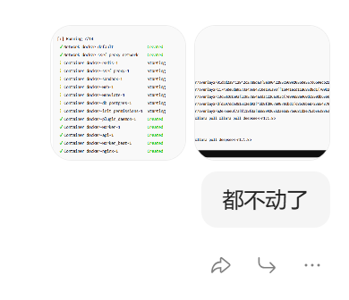
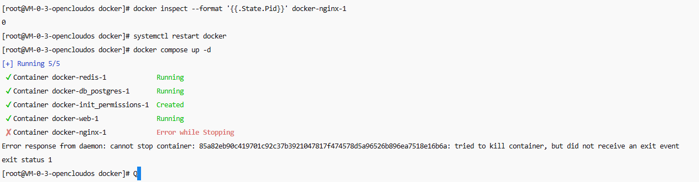
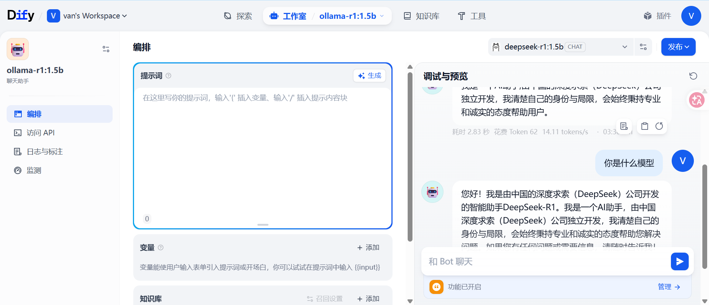

## 👋 Hello,Dify！

> 昨天晚上在我的轻量服务器上搞了一下Dify，十分的不顺利那，想着早睡又搞到了24点，想着今天一定要记录一下

> 本文摘要：服务器部署Dify+Ollama踩坑

* 我这个4核4G的轻量云上部署了一个docker
```
[root@VM-0-3-opencloudos ~]# docker images
REPOSITORY                                      TAG              IMAGE ID       CREATED         SIZE
nginx                                           latest           6c3a6ea6608c   29 hours ago    161MB
postgres                                        15-alpine        c1dd58d6cec8   32 hours ago    274MB
ollama/ollama                                   latest           013cbb5ffadc   6 days ago      6.29GB
redis                                           6-alpine         474c77ec7e49   6 days ago      30.2MB
langgenius/dify-api                             1.13.3           9b188598cfa1   4 weeks ago     2.92GB
langgenius/dify-web                             1.13.3           17b217cdd2c5   4 weeks ago     341MB
langgenius/dify-sandbox                         0.2.14           469ccccb7ceb   4 weeks ago     569MB
langgenius/dify-plugin-daemon                   0.5.3-local      c138e8c0e115   3 months ago    1.49GB
docker.elastic.co/elasticsearch/elasticsearch   8.19.10          dc150f2b7fb6   3 months ago    1.39GB
ubuntu/squid                                    latest           f49c57d20819   4 months ago    205MB
minio/minio                                     latest           69b2ec208575   7 months ago    175MB
semitechnologies/weaviate                       1.27.0           f24b5f0e68e6   18 months ago   161MB
busybox                                         latest           925ff61909ae   19 months ago   4.42MB
neo4j                                           5.22-community   468584de930e   21 months ago   506MB
ankane/pgvector                                 v0.5.0           272a4ebc8cc3   2 years ago     414MB
```

首先我根据教程下载[dify](https://github.com/langgenius/dify)的项目，进入`/dify/docker`路径，执行 `cp .env.example .env`，然后就可以`docker compose up -d`，最后输入`http://localhost/install`即可访问
* 不出意外的话要出意外了
1. 因为我的是要对接ollama来实现一个简单的对话项目，在部署[ollama](https://ollama.ai/)的时候，启动时使用了`docker run -p 11434:11434 ollama/ollama`没有指定`--name ollama`完整：`docker run --name ollama -p 11434:11434 ollama/ollama`，检测ollama安装是否成功的时候`docker exec -it ollama ollama --version`显示找不到ollama容器，通过`docker ps`查看随机生成的ollama的名字才正确查询版本，控制台测试模型对话：`docker exec -it ollama(这是容器名) ollama run deepseek-r1:7b`。
2. 安装成功后我要下载一个deepseek模型，迫于服务器太小，我选择了最小的deepseek-r1:1.5b，几分钟过后进度一直卡在70%，且另一边dify的compose也没完成，在又过了几分钟之后，终于显示断开连接，当我在进入服务器控制台免密登录的时候已经显示无法登录。

在der包的指挥下，我使用VNC登录，可是依旧无法登录，最终还是选择了重启大法，等待5分钟之后重启成果，内存CPU占用也都降下来了。

3. 启动后我先尝试重新部署dify，显示成功后我访问页面地址显示404，der包一路指引，最终我选择了Gemini......使用`docker compose ps`命令查看nginx服务（退出码 137），正在无限重启，der包告诉我是占用了端口80，我kill之后依旧无法启动，而Gemini指出是宝塔占用了80，因此建议我更换8080端口。在我修改.env文件一顿操作后，依旧无法正常启动，AI告诉我是docker死锁，要彻底清理容器才能解决，于是：

```
systemctl stop docker
systemctl stop containerd

# 截图里报错显示了容器的id
rm -rf /var/lib/docker/containers/85a82eb90c4*

systemctl start containerd
systemctl start docker

# 这里只会重新部署未成功的容器
docker compose up -d
```
4. 到这里ollama的模型，dify的页面，都成功部署和进入了，接下来就该将两者连接起来，首先需要在dify的设置里添加ollama插件，在安装插件的时候又双叒叕......点击安装后就自动缩小消失了，页面也没有报错，当我到处寻找的时候，发现首页右上角有几条未读消息，这个dify的报错居然写在这里面...于是复制发给Gemini(其实翻译就能看懂是超时了，已经力竭)

```
failed to launch plugin: failed to install dependencies: failed to install dependencies: signal: killed, output: DEBUG uv 0.9.26

DEBUG Acquired shared lock for `/root/.cache/uv`

DEBUG Found project root: `/app/storage/cwd/langgenius/ollama-0.1.3@66e156c4f612964c131c49168882e78c2cdfe366879506b97ad855b23c5d6d98`

DEBUG No workspace root found, using project root

DEBUG Acquired exclusive lock for `/app/storage/cwd/langgenius/ollama-0.1.3@66e156c4f612964c131c49168882e78c2cdfe366879506b97ad855b23c5d6d98`

DEBUG No...://files.pythonhosted.org/packages/c2/b0/956902e5e1302f8c5d124e219c6bf214e2649f92ad5fce85b05c039a04c9/zope_event-6.1-py3-none-any.whl

DEBUG Sending fresh GET request for: https://files.pythonhosted.org/packages/c2/b0/956902e5e1302f8c5d124e219c6bf214e2649f92ad5fce85b05c039a04c9/zope_event-6.1-py3-none-any.whl

Downloading tiktoken (1.1MiB)

Downloading numpy (15.3MiB)

Downloading gevent (2.0MiB)

Downloading pydantic-core (2.0MiB)

init process exited due to no activity for 120 seconds

failed to init environment
```
解决办法:
```
vi docker-compose.yaml

# 找到 plugin_daemon 服务并添加环境变量，不要删掉大括号里的-，也是一个坑
PIP_MIRROR_URL: ${PIP_MIRROR_URL:-https://mirrors.cloud.tencent.com/pypi/simple/}
UV_INDEX_URL: https://mirrors.cloud.tencent.com/pypi/simple/

# 重启，docker compose命令必须在docker-compose.yaml所在目录下执行
docker compose up -d --force-recreate plugin_daemon
```
5. 安装插件后需要配置模型，连不上模型，这里需要找到服务器控制台里写的内网地址，用这个地址去作为ip配置，模型名称写对，就可以保存成功了。随后点击顶部的工作室，新建应用，选择模型和应用类型就可以进入对话了。

