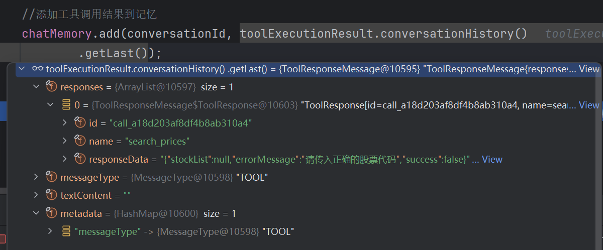
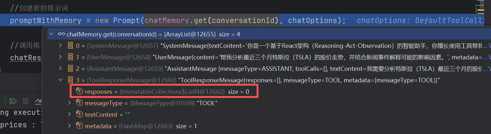
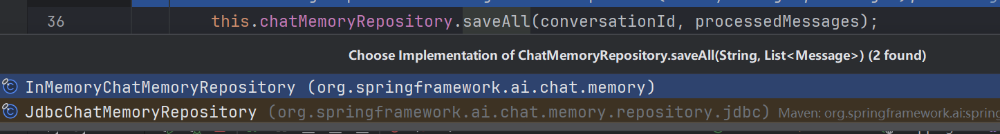
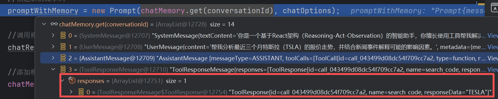
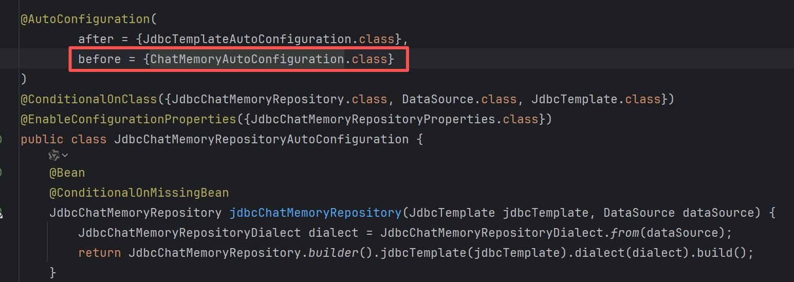
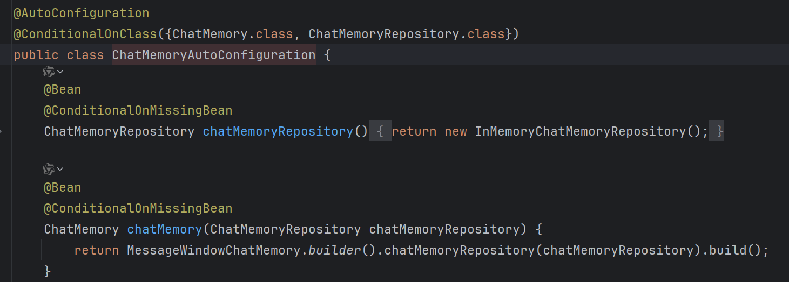
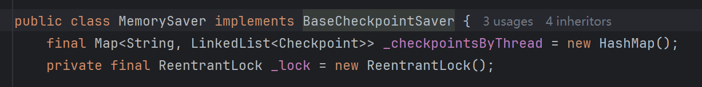

## 👋 Hello,Agent!
我在测试agent react功能的时候，在工具结果里可以拿到返回值，但是加到记忆里后重新构建提示词就会丢失结果
代码逻辑：
1. 我自定义了一个查询工具，实现了三个方法，分别是模拟返回近期股票价格，近期新闻，根据公司名称查询股票代码
2. 自定义react提示词，根据是否需要调用工具判断是否循环react，并将工具调用结果存入对话记忆，最终无需工具调用输出结果。我在提示词里故意写错股票代码，期望ai在思考中发现需要调用查询股票代码工具，最终实现正确查回结果
```java
public String chatWithSpringAi(String conversationId) {
        //定义ChatOptions
        ChatOptions chatOptions = ToolCallingChatOptions.builder()
                //指定工具
                .toolCallbacks(ToolCallbacks.from(new StockTools()))
                //指定不自动执行工具，否则会自动执行工具，导致无法通过hasToolCalls判断
                .internalToolExecutionEnabled(false)
                .build();
        //定义提示词，要求按照React架构运行
        Prompt prompt = new Prompt(
                List.of(new SystemMessage("你是一个基于React架构（Reasoning-Act-Observation）的智能助手，你擅长使用工具帮我解决问题。" +
                        "你的工作流程是：" +
                        "1、思考：先根据用户的提问进行思考，推理出下一步需要进行的具体系统" +
                        "2、行动：做具体的行动，这一步可以使用工具" +
                        "3、观察：记录前一步行动的结果。你可以进行多轮思考和行动。如果要使用工具，请务必调用工具，不要自己随便捏造结果。"
                        + "约束：时间通过工具获取，不要捏造"), new UserMessage("帮我分析最近三个月特斯拉（TSLA）的股价走势，并结合新闻事件解释可能的影响因素。")),
                chatOptions);
        //添加提示词到记忆
        chatMemory.add(conversationId, prompt.getInstructions());
        Prompt promptWithMemory = new Prompt(chatMemory.get(conversationId), chatOptions);
        //调用模型
        ChatResponse chatResponse = chatModel.call(promptWithMemory);
        //添加模型返回结果到记忆
        chatMemory.add(conversationId, chatResponse.getResult().getOutput());
        //循环处理工具调用
        while (chatResponse.hasToolCalls()) {
            //执行工具调用
            ToolExecutionResult toolExecutionResult = toolCallingManager.executeToolCalls(promptWithMemory,
                    chatResponse);
            //添加工具调用结果到记忆
            chatMemory.add(conversationId, toolExecutionResult.conversationHistory()
                    .getLast());
            //创建新的提示词
            promptWithMemory = new Prompt(chatMemory.get(conversationId), chatOptions);
            //调用模型
            chatResponse = chatModel.call(promptWithMemory);
            //添加模型返回结果到记忆
            chatMemory.add(conversationId, chatResponse.getResult().getOutput());
        }
        return chatResponse.getResult().getOutput().getText();
    }
//日志如下：
2026-04-29T17:01:02.396+08:00 DEBUG 10508 --- [nio-8008-exec-1] o.s.ai.tool.method.MethodToolCallback    : Starting execution of tool: search_prices
search_prices : TSLA
2026-04-29T17:01:02.397+08:00 DEBUG 10508 --- [nio-8008-exec-1] o.s.ai.tool.method.MethodToolCallback    : Successful execution of tool: search_prices
2026-04-29T17:01:02.397+08:00 DEBUG 10508 --- [nio-8008-exec-1] o.s.a.t.e.DefaultToolCallResultConverter : Converting tool result to JSON.
2026-04-29T17:01:04.706+08:00 DEBUG 10508 --- [nio-8008-exec-1] o.s.a.m.tool.DefaultToolCallingManager   : Executing tool call: search_prices
2026-04-29T17:01:04.706+08:00 DEBUG 10508 --- [nio-8008-exec-1] o.s.ai.tool.method.MethodToolCallback    : Starting execution of tool: search_prices
search_prices : TSLA
2026-04-29T17:01:04.707+08:00 DEBUG 10508 --- [nio-8008-exec-1] o.s.ai.tool.method.MethodToolCallback    : Successful execution of tool: search_prices
2026-04-29T17:01:04.707+08:00 DEBUG 10508 --- [nio-8008-exec-1] o.s.a.t.e.DefaultToolCallResultConverter : Converting tool result to JSON.
2026-04-29T17:01:07.248+08:00 DEBUG 10508 --- [nio-8008-exec-1] o.s.a.m.tool.DefaultToolCallingManager   : Executing tool call: search_prices
2026-04-29T17:01:07.248+08:00 DEBUG 10508 --- [nio-8008-exec-1] o.s.ai.tool.method.MethodToolCallback    : Starting execution of tool: search_prices
search_prices : TSLA
```

根据日志可以看出，ai一直再在复查询价格，并没有发现工具早就返回了错误，debug发现，工具结果根本就没有存入记忆，如下图


经过多次debug调试，我发现同一对话id在重启项目后依旧会保持上次的记忆，但是我使用的是内存记忆，所以每次重启项目都应该丢失记忆，于是我进入源码debug`chatMemory.add`方法，发现最终调用的jdbc的记忆

于是我自定义了一个记忆Bean
```java
@Configuration
public class AiConfig {
    /**
     * 指定聊天记录使用内存记忆
     * @return
     */
    @Bean
    public ChatMemory chatMemory() {
        return MessageWindowChatMemory.builder().build();
    }
}
```
这里发现他拿到了工具结果并存入内存了

* 思考

为什么我没有指定记忆类型，却存到了数据库？

这就要从罪魁祸首下手，spring项目遇事不决AutoConfiguration，直接搜索`JdbcChatMemoryAutoConfiguration`


真相大白，jdbc优先级高于内存记忆，spring在发现你JdbcTemplateAutoConfiguration存在后，会帮你自动装配JdbcChatMemoryAutoConfiguration，于是对话记忆就变成了基于数据库的，这也解释了为什么我重启后仍然有记忆

果然代码不会出错，只有粗心的人啊！

* 拓展

我在使用springAIAlibaba实现react的时候，没有出现这种问题，原因是在配置ReactAgent的时候，new了一个MemorySaver，就是在告诉 JVM：“我要自己在这个方法的生命周期里实例化一个对象，不需要 Spring 来插手。”

```java
ReactAgent agent = ReactAgent.builder()
                .name("executor")
                .model(chatModel)
                .tools(ToolCallbacks.from(new StockTools()))
                .systemPrompt(systemPrompt)
                .saver(new MemorySaver())
                .build();
```
进到MemorySaver源码里也可以看见，这就是基于hashmap实现的内存记忆
