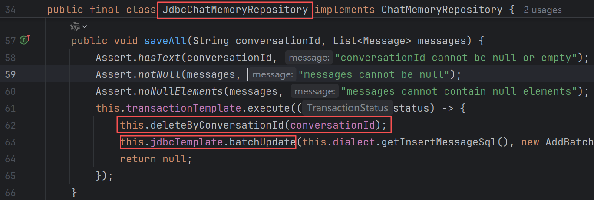
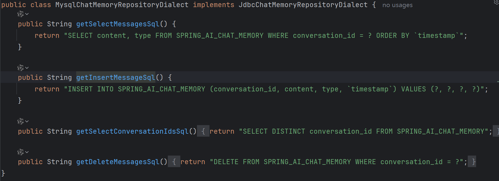
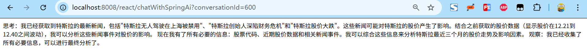
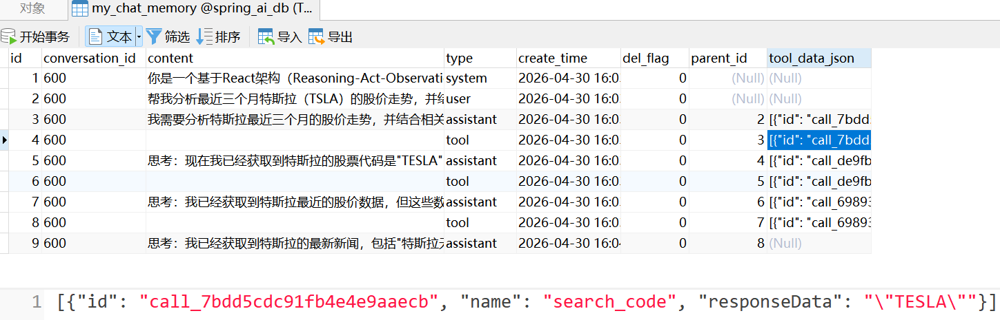

## 👋 Hello again,Agent!

经过昨天的披荆斩棘，顺利通过了react agent的测试，但是昨晚我又重新思考，即使是使用了jdbc的记忆，也不应该丢失信息呀，难道springai有缺陷？

继续深入源码，发现springai的jdbcmemory的实现逻辑，有点“草率”，它是全量删除再批量插入，且仅支持他定义的几个字段，因为sql是硬编码。



看来jdbc丢数据的原因已经基本找到了，使用现有的功能是无法实现了，那么就只能重写。

这里我们新建一套新表的数据库代码，并重写`JdbcChatMemoryRepository`和`JdbcChatMemoryRepositoryDialect`来实现自定义表字段以及持久化操作。

直接上代码吧，注释的已经很清楚了，新表的数据库代码就不做展示了，都是基于mybatisplus的。
```java
@TableName(value ="my_chat_memory")
@Data
public class MyChatMemory implements Serializable {

        @TableId(type = IdType.AUTO)
        private Long id;

        private String conversationId;//保留的Spring框架的会话Id字段

        private String content;

        private String type;

        private Date createTime;

        private Boolean delFlag;

        private Long parentId;//该内容的上一条对话内容的id，对应的是id不是conversationId

        private String toolDataJson;

        @TableField(exist = false)
        private static final long serialVersionUID = 1L;

}
===========================================================================
@Component
@Slf4j
public class MyJdbcChatMemoryRepository implements ChatMemoryRepository {

    private final TransactionTemplate transactionTemplate;

    private final MyChatMemoryMapper myChatMemoryMapper;

    private final MyChatMemoryService myChatMemoryService;


    /**
     * 特性 1：绝对安全（Immutability）。加上了 final 关键字，意味着这个类一旦被实例化，
     * 它的 Mapper 和 Service 就永远不可能被篡改，保证了线程安全。
     * <p>
     * 特性 2：脱离 Spring 也能活。如果你写单元测试，
     * 你可以直接 new JdbcEnhanceChatMemoryRepository(mockJdbc, mockMapper, mockService, mockTx)，
     * 不需要启动整个 Spring 容器就能测试。
     * <p>
     * 特性 3：强制依赖明确。它告诉所有人：“没有这四个参数，你连我这个对象都别想创建出来”。
     *
     * @param jdbcTemplate
     * @param myChatMemoryMapper
     * @param myChatMemoryService
     * @param txManager
     */
    private MyJdbcChatMemoryRepository(JdbcTemplate jdbcTemplate, @Autowired
                                       MyChatMemoryMapper myChatMemoryMapper, @Autowired
                                       MyChatMemoryService myChatMemoryService,
                                       PlatformTransactionManager txManager) {
        Assert.notNull(jdbcTemplate, "jdbcTemplate cannot be null");
        this.transactionTemplate = new TransactionTemplate(
                txManager != null ? txManager : new DataSourceTransactionManager(jdbcTemplate.getDataSource()));
        this.myChatMemoryMapper = myChatMemoryMapper;
        this.myChatMemoryService = myChatMemoryService;
    }

    @Override
    public List<String> findConversationIds() {
        return myChatMemoryMapper.selectList(new LambdaQueryWrapper<MyChatMemory>()
                .eq(MyChatMemory::getDelFlag, 0)).stream().map(MyChatMemory::getConversationId).toList();
    }

    @Override
    public List<Message> findByConversationId(String conversationId) {
        Assert.hasText(conversationId, "conversationId cannot be null or empty");
        List<MyChatMemory> myChatMemories = myChatMemoryMapper.selectList(new LambdaQueryWrapper<MyChatMemory>()
                .eq(MyChatMemory::getConversationId, conversationId)
                .eq(MyChatMemory::getDelFlag, 0)
                .orderByAsc(MyChatMemory::getCreateTime));
        // 将数据库里的数据转换成 Message 对象
        return myChatMemories.stream()
                .map(chatMemory -> {
                    String content = chatMemory.getContent();
                    MessageType type = MessageType.fromValue(chatMemory.getType());
                    String toolJson = chatMemory.getToolDataJson(); // 储存工具调用结果的关键

                    Message mes; // 声明一个接口变量

                    // 根据数据库里存的 type，去new不同的具体实现类
                    switch (type) {
                        case USER:
                            mes = new UserMessage(content);
                            break;
                        case SYSTEM:
                            mes = new SystemMessage(content);
                            break;
                        case ASSISTANT:
                            if (StringUtils.isNotBlank(toolJson)) {
                                // 如果有工具调用指令，反序列化后塞进去
                                List<AssistantMessage.ToolCall> calls = JSON.parseArray(toolJson, AssistantMessage.ToolCall.class);
                                mes = AssistantMessage.builder().content(content).toolCalls(calls).build();
                            } else {
                                mes = new AssistantMessage(content);
                            }
                            break;
                        case TOOL:
                            // 将存入的工具执行结果反序列化塞回去
                            List<ToolResponseMessage.ToolResponse> responses = JSON.parseArray(toolJson, ToolResponseMessage.ToolResponse.class);
                            mes = ToolResponseMessage.builder().responses(responses).build();
                            break;
                        default:
                            throw new IllegalArgumentException("未知的消息类型: " + type);
                    }
                    return mes;
                }).toList();
    }

    /**
     * 实现回话回退，通过子父节点实现，目前仅支持memory层面
     * Advisor未做修改，需要修改before 方法，对话回退场景下，先插入当前对话，待数据库整理好新的父子逻辑，再查询
     * 否则会出现已经组装好prompt，再插入并整理父子逻辑，造成本次对话无法实现回退，下次才生效
     * @param conversationId
     * @param messages
     */
    @Override
    public void saveAll(String conversationId, List<Message> messages) {
        Assert.hasText(conversationId, "conversationId cannot be null or empty");
        Assert.notNull(messages, "messages cannot be null");
        Assert.noNullElements(messages, "messages cannot contain null elements");

        //放在事务中执行
        this.transactionTemplate.execute(status -> {
            Long lastId = null;
            List<MyChatMemory> chatMemories = myChatMemoryMapper.selectList(new LambdaQueryWrapper<MyChatMemory>()
                    .eq(MyChatMemory::getConversationId, conversationId)
                    .eq(MyChatMemory::getDelFlag, false)
                    .orderByAsc(MyChatMemory::getCreateTime));

            for (Message message : messages) {
                Map<String, Object> metadata = message.getMetadata();
                // 情况 A：前端明确传了 parent_id (触发了回退)
                if (metadata.get("parent_id") != null && metadata.get("parent_id") instanceof Number) {
                    lastId = ((Number) metadata.get("parent_id")).longValue();
                } else if (!CollectionUtils.isEmpty(chatMemories)) {
                    // 情况 B：正常聊天，没有传 parent_id
                    lastId = chatMemories.getLast().getId();
                }

                if (!Objects.isNull(lastId)) {
                    // 把查出来的历史记录，变成一个【父亲 -> 儿子】的映射表
                    Map<Long, Long> idChildrenMap = chatMemories.stream()
                            .collect(Collectors.toMap(MyChatMemory::getParentId, MyChatMemory::getId, (a, b) -> b));
                    //例如库里现在是1 2 3 4 5 ，现在穿来了一个parent_id=3，那么就会把3的子节点也就是4，5全部删除
                    // 检查：我们刚才选定的父亲 (lastId)，它是不是已经有儿子了？
                    if (idChildrenMap.containsKey(lastId)) {
                        Long childrenId = idChildrenMap.get(lastId); // 揪出它的大儿子，可能会有很多，但是按时间排序后4就是大儿子
                        LinkedList<Long> childrenIds = new LinkedList<>();
                        while (childrenId != null) {
                            //将所有的子集存入childrenIds
                            childrenIds.addLast(childrenId);
                            childrenId = idChildrenMap.get(childrenId);
                        }
                        //Hash 表的底层是数组加散列函数，它是瞬间定位的（时间复杂度是 $O(1)$），但是这里没有遍历操作，所以无所谓
                        // 并删除子集
                        HashSet<Long> childrenIdSet = new HashSet<>(childrenIds);
                        if (!CollectionUtils.isEmpty(childrenIdSet)) {
                            myChatMemoryService.update(new LambdaUpdateWrapper<MyChatMemory>()
                                    .set(MyChatMemory::getDelFlag, true)
                                    .in(MyChatMemory::getId, childrenIdSet));
                        }
                    }
                }
                //保存对话
                MyChatMemory myChatMemory = new MyChatMemory();
                myChatMemory.setConversationId(conversationId);
                myChatMemory.setContent(message.getText());
                myChatMemory.setType(message.getMessageType().getValue());
                myChatMemory.setParentId(lastId);
                myChatMemory.setCreateTime(new Date());
                myChatMemory.setDelFlag(false);
                if (message instanceof AssistantMessage am && !CollectionUtils.isEmpty(am.getToolCalls())) {
                    myChatMemory.setToolDataJson(JSON.toJSONString(am.getToolCalls()));
                } else if (message instanceof ToolResponseMessage tm && !CollectionUtils.isEmpty(tm.getResponses())) {
                    myChatMemory.setToolDataJson(JSON.toJSONString(tm.getResponses()));
                }
                myChatMemoryMapper.insert(myChatMemory);
            }
            return null;
        });
    }

    @Override
    public void deleteByConversationId(String conversationId) {
        Assert.hasText(conversationId, "conversationId cannot be null or empty");
        //改为逻辑删除
        myChatMemoryService.update(new LambdaUpdateWrapper<MyChatMemory>()
                .eq(MyChatMemory::getConversationId, conversationId)
                .set(MyChatMemory::getDelFlag, 1));
    }

    public static MyJdbcChatMemoryRepository.Builder builder() {
        return new MyJdbcChatMemoryRepository.Builder();
    }

    private record AddBatchPreparedStatement(String conversationId, List<Message> messages,
                                             AtomicLong sequenceId) implements BatchPreparedStatementSetter {

        private AddBatchPreparedStatement(String conversationId, List<Message> messages) {
            // Use second-level granularity to ensure compatibility with all database
            // timestamp precisions. The timestamp serves as a sequence number for
            // message ordering, not as a precise temporal record.
            this(conversationId, messages, new AtomicLong(Instant.now().getEpochSecond()));
        }

        @Override
        public void setValues(PreparedStatement ps, int i) throws SQLException {
            var message = this.messages.get(i);

            ps.setString(1, this.conversationId);
            ps.setString(2, message.getText());
            ps.setString(3, message.getMessageType().name());
            // Convert seconds to milliseconds for Timestamp constructor.
            // Each message gets a unique second value, ensuring proper ordering.
            ps.setTimestamp(4, new Timestamp(this.sequenceId.getAndIncrement() * 1000L));
        }

        @Override
        public int getBatchSize() {
            return this.messages.size();
        }
    }

    private static class MessageRowMapper implements RowMapper<Message> {

        @Override
        @Nullable
        public Message mapRow(ResultSet rs, int i) throws SQLException {
            var content = rs.getString(1);
            var type = MessageType.valueOf(rs.getString(2));

            return switch (type) {
                case USER -> new UserMessage(content);
                case ASSISTANT -> new AssistantMessage(content);
                case SYSTEM -> new SystemMessage(content);
                // The content is always stored empty for ToolResponseMessages.
                // If we want to capture the actual content, we need to extend
                // AddBatchPreparedStatement to support it.
                case TOOL -> ToolResponseMessage.builder().responses(List.of()).build();
            };
        }

    }

    public static final class Builder {

        private JdbcTemplate jdbcTemplate;

        private MyChatMemoryService myChatMemoryService;

        private MyChatMemoryMapper myChatMemoryMapper;

        private DataSource dataSource;

        private PlatformTransactionManager platformTransactionManager;

        private static final Logger logger = LoggerFactory.getLogger(Builder.class);

        private Builder() {
        }

        public Builder jdbcTemplate(JdbcTemplate jdbcTemplate) {
            this.jdbcTemplate = jdbcTemplate;
            return this;
        }

        public Builder dataSource(DataSource dataSource) {
            this.dataSource = dataSource;
            return this;
        }

        public Builder transactionManager(PlatformTransactionManager txManager) {
            this.platformTransactionManager = txManager;
            return this;
        }

        public Builder myChatMemoryMapper(MyChatMemoryMapper myChatMemoryMapper) {
            this.myChatMemoryMapper = myChatMemoryMapper;
            return this;
        }

        public Builder myChatMemoryService(MyChatMemoryService myChatMemoryService) {
            this.myChatMemoryService = myChatMemoryService;
            return this;
        }

        public MyJdbcChatMemoryRepository build() {
            return new MyJdbcChatMemoryRepository(resolveJdbcTemplate(), this.myChatMemoryMapper,
                    this.myChatMemoryService,
                    this.platformTransactionManager);
        }

        private JdbcTemplate resolveJdbcTemplate() {
            if (this.jdbcTemplate != null) {
                return this.jdbcTemplate;
            }
            if (this.dataSource != null) {
                return new JdbcTemplate(this.dataSource);
            }
            throw new IllegalArgumentException("DataSource must be set (either via dataSource() or jdbcTemplate())");
        }

        private DataSource resolveDataSource() {
            if (this.dataSource != null) {
                return this.dataSource;
            }
            if (this.jdbcTemplate != null && this.jdbcTemplate.getDataSource() != null) {
                return this.jdbcTemplate.getDataSource();
            }
            throw new IllegalArgumentException("DataSource must be set (either via dataSource() or jdbcTemplate())");
        }

        /**
         * Logs a warning if the explicitly set dialect differs from the dialect detected
         * from the DataSource.
         */
        private void warnIfDialectMismatch(DataSource dataSource, JdbcChatMemoryRepositoryDialect explicitDialect) {
            JdbcChatMemoryRepositoryDialect detected = JdbcChatMemoryRepositoryDialect.from(dataSource);
            if (!detected.getClass().equals(explicitDialect.getClass())) {
                logger.warn("Explicitly set dialect {} will be used instead of detected dialect {} from datasource",
                        explicitDialect.getClass().getSimpleName(), detected.getClass().getSimpleName());
            }
        }

    }
}
===========================================================================
public class MyMessageWindowChatMemory implements ChatMemory {

    private static final int DEFAULT_MAX_MESSAGES = 20;

    private final ChatMemoryRepository chatMemoryRepository;

    private final int maxMessages;

    private MyMessageWindowChatMemory(ChatMemoryRepository chatMemoryRepository, int maxMessages) {
        Assert.notNull(chatMemoryRepository, "chatMemoryRepository cannot be null");
        Assert.isTrue(maxMessages > 0, "maxMessages must be greater than 0");
        this.chatMemoryRepository = chatMemoryRepository;
        this.maxMessages = maxMessages;
    }

    @Override
    public void add(String conversationId, List<Message> messages) {
        Assert.hasText(conversationId, "conversationId cannot be null or empty");
        Assert.notNull(messages, "messages cannot be null");
        Assert.noNullElements(messages, "messages cannot contain null elements");

        this.chatMemoryRepository.saveAll(conversationId, messages);
    }

    @Override
    public List<Message> get(String conversationId) {
        Assert.hasText(conversationId, "conversationId cannot be null or empty");
        List<Message> allMessage = this.chatMemoryRepository.findByConversationId(conversationId);
        //返回符合条数的消息
        return this.process(allMessage, List.of());
    }

    @Override
    public void clear(String conversationId) {
        Assert.hasText(conversationId, "conversationId cannot be null or empty");
        this.chatMemoryRepository.deleteByConversationId(conversationId);
    }

    /**
     * 处理消息，删除多余的SystemMessage
     *
     * @param memoryMessages
     * @param newMessages
     * @return
     */
    private List<Message> process(List<Message> memoryMessages, List<Message> newMessages) {
        List<Message> processedMessages = new ArrayList<>();

        Set<Message> memoryMessagesSet = new HashSet<>(memoryMessages);
        boolean hasNewSystemMessage = newMessages.stream()
                .filter(SystemMessage.class::isInstance)
                .anyMatch(message -> !memoryMessagesSet.contains(message));

        memoryMessages.stream()
                .filter(message -> !(hasNewSystemMessage && message instanceof SystemMessage))
                .forEach(processedMessages::add);

        processedMessages.addAll(newMessages);

        if (processedMessages.size() <= this.maxMessages) {
            return processedMessages;
        }

        int messagesToRemove = processedMessages.size() - this.maxMessages;

        List<Message> trimmedMessages = new ArrayList<>();
        int removed = 0;
        for (Message message : processedMessages) {
            if (message instanceof SystemMessage || removed >= messagesToRemove) {
                trimmedMessages.add(message);
            } else {
                removed++;
            }
        }

        return trimmedMessages;
    }

    public static Builder builder() {
        return new Builder();
    }

    public static final class Builder {

        private ChatMemoryRepository chatMemoryRepository;

        private int maxMessages = DEFAULT_MAX_MESSAGES;

        private Builder() {
        }

        public Builder chatMemoryRepository(ChatMemoryRepository chatMemoryRepository) {
            this.chatMemoryRepository = chatMemoryRepository;
            return this;
        }

        public Builder maxMessages(int maxMessages) {
            this.maxMessages = maxMessages;
            return this;
        }

        public MyMessageWindowChatMemory build() {
            if (this.chatMemoryRepository == null) {
                this.chatMemoryRepository = new InMemoryChatMemoryRepository();
            }
            return new MyMessageWindowChatMemory(this.chatMemoryRepository, this.maxMessages);
        }

    }
}
===========================================================================
@RestController
@RequestMapping("/react")
public class ReactAgentController {

    @Autowired
    @Qualifier("jdbcChatMemory")
    private ChatMemory chatMemory;

    @Autowired
    private ChatModel chatModel;

    @Autowired
    ToolCallingManager toolCallingManager;

    @GetMapping("/chatWithSpringAi")
    public String chatWithSpringAi(String conversationId) {
        //定义ChatOptions
        ChatOptions chatOptions = ToolCallingChatOptions.builder()
                //指定工具
                .toolCallbacks(ToolCallbacks.from(new StockTools()))
                //指定不自动执行工具，否则会自动执行工具，导致无法通过hasToolCalls判断
                .internalToolExecutionEnabled(false)
                .build();
        //定义提示词，要求按照React架构运行
        Prompt prompt = new Prompt(
                List.of(new SystemMessage("你是一个基于React架构（Reasoning-Act-Observation）的智能助手，你擅长使用工具帮我解决问题。" +
                        "你的工作流程是：" +
                        "1、思考：先根据用户的提问进行思考，推理出下一步需要进行的具体系统" +
                        "2、行动：做具体的行动，这一步可以使用工具" +
                        "3、观察：记录前一步行动的结果。你可以进行多轮思考和行动。如果要使用工具，请务必调用工具，不要自己随便捏造结果。"
                        + "约束：时间通过工具获取，不要捏造"), new UserMessage("帮我分析最近三个月特斯拉（TSLA）的股价走势，并结合新闻事件解释可能的影响因素。")),
                chatOptions);
        //添加提示词到记忆
        chatMemory.add(conversationId, prompt.getInstructions());
        Prompt promptWithMemory = new Prompt(chatMemory.get(conversationId), chatOptions);
        //调用模型
        ChatResponse chatResponse = chatModel.call(promptWithMemory);
        //添加模型返回结果到记忆
        chatMemory.add(conversationId, chatResponse.getResult().getOutput());
        //循环处理工具调用
        while (chatResponse.hasToolCalls()) {
            //执行工具调用
            ToolExecutionResult toolExecutionResult = toolCallingManager.executeToolCalls(promptWithMemory,
                    chatResponse);
            //添加工具调用结果到记忆
            chatMemory.add(conversationId, toolExecutionResult.conversationHistory()
                    .getLast());
            //创建新的提示词
            promptWithMemory = new Prompt(chatMemory.get(conversationId), chatOptions);
            //调用模型
            chatResponse = chatModel.call(promptWithMemory);
            //添加模型返回结果到记忆
            chatMemory.add(conversationId, chatResponse.getResult().getOutput());
        }
        for (Message message : chatMemory.get(conversationId)) {
            System.out.println(message);
        }
        return chatResponse.getResult().getOutput().getText();
    }
}
===========================================================================
@Configuration
public class AiConfig {

    //如果MyJdbcChatMemoryRepository没有添加@Component就需要自己声明一个bean
//    @Bean
//    public MyJdbcChatMemoryRepository myJdbcChatMemoryRepository() {
//       return MyJdbcChatMemoryRepository.builder().build();
//    }

    /**
     * 聊天记录使用数据库存储
     * @param myJdbcChatMemoryRepository
     * @return
     */
    @Bean
    public ChatMemory jdbcChatMemory(MyJdbcChatMemoryRepository myJdbcChatMemoryRepository) {
        return MyMessageWindowChatMemory.builder()
                .maxMessages(10)
                .chatMemoryRepository(myJdbcChatMemoryRepository)
                .build();
    }

//这两个是独立的 Bean，互不关联。如果你注入 ChatMemory，用的是数据库；如果直接注入 ChatMemoryRepository，用的是内存。

    /**
     * 指定聊天记录使用内存记忆
     * @return
     */
    @Bean
    public ChatMemoryRepository chatMemoryRepository() {
        return new InMemoryChatMemoryRepository();
    }

//    /**
//     * 写法2
//     * @return
//     */
//    @Bean
//    public ChatMemory chatMemory() {
//        return MessageWindowChatMemory.builder()
//                .chatMemoryRepository(new InMemoryChatMemoryRepository()).build();
//    }
//
//    /**
//     * 写法3,因为默认就是内存记忆，所以可以不写chatMemoryRepository
//     * @return
//     */
//    @Bean
//    public ChatMemory chatMemory() {
//        return MessageWindowChatMemory.builder().build();
//    }
}
===========================================================================
CREATE TABLE `my_chat_memory` (
  `id` bigint(20) NOT NULL AUTO_INCREMENT COMMENT '主键ID',
  `conversation_id` varchar(255) NOT NULL COMMENT 'Spring AI会话ID',
  `content` longtext COMMENT '消息主体内容(文本)',
  `type` varchar(50) NOT NULL COMMENT '消息类型(user/assistant/system/tool)',
  `create_time` datetime DEFAULT CURRENT_TIMESTAMP COMMENT '消息创建时间',
  `del_flag` tinyint(1) DEFAULT '0' COMMENT '逻辑删除标记(0-正常, 1-已删除)',
  `parent_id` bigint(20) DEFAULT NULL COMMENT '父节点ID(用于会话链路和回退)',
  `tool_data_json` json DEFAULT NULL COMMENT '工具调用的原始JSON数据',
  PRIMARY KEY (`id`),
  KEY `idx_conversation_id` (`conversation_id`),
  KEY `idx_parent_id` (`parent_id`)
) ENGINE=InnoDB DEFAULT CHARSET=utf8mb4 COLLATE=utf8mb4_unicode_ci COMMENT='AI对话记忆表(带分支链路和工具支持)';
```




呜呼！！！🎉🎉🎉
